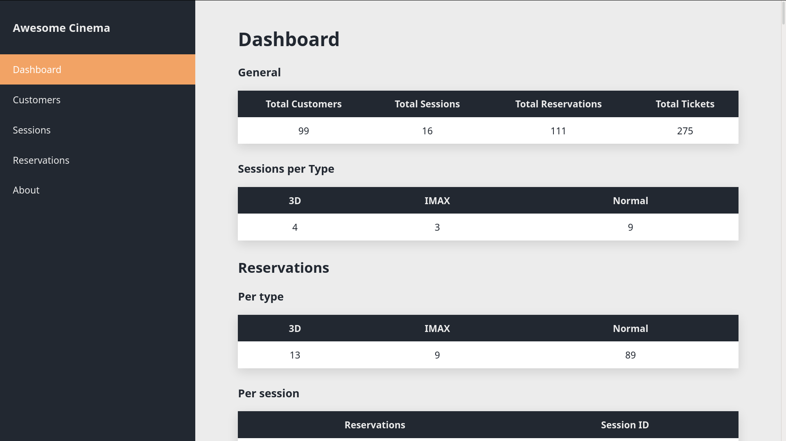
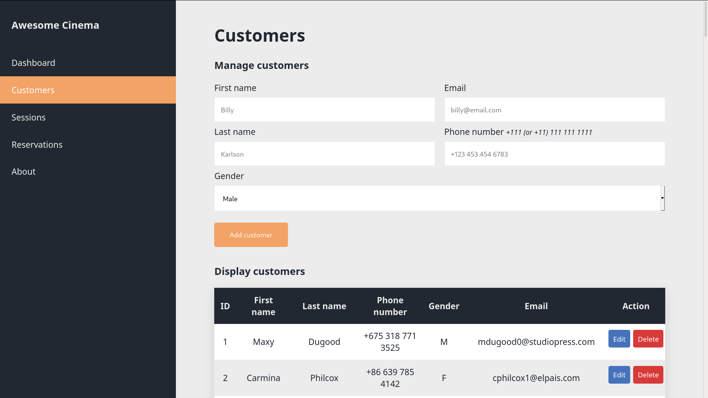
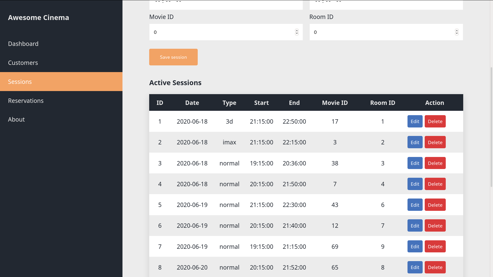
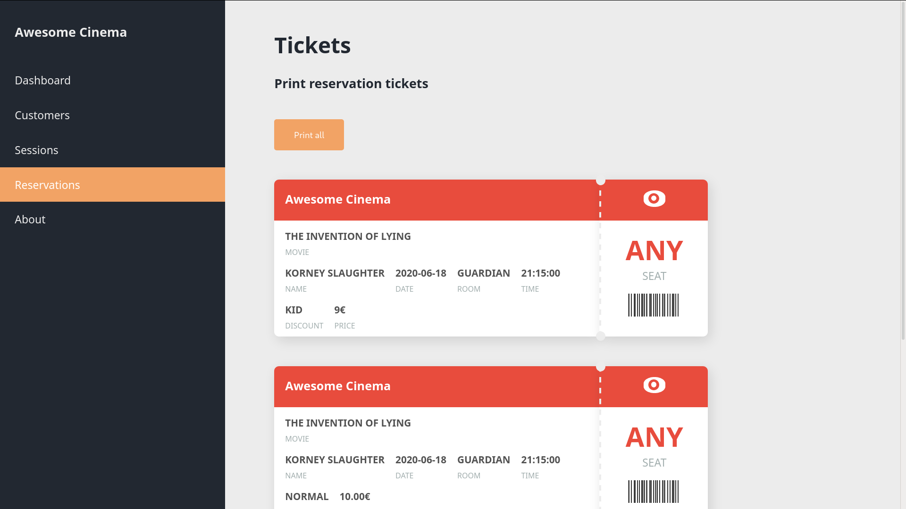

# 🎥 Awesome Cinema
An awesome movie reservation system!


_Awesome Cinema Dashboard_

## What is it?
Awesome Cinema is a **simple movie reservation** system and it's part of my university assignment in Databases 1 course. It's also my first ever fullstack web application made entirely from scratch starting from the database ERD to frontend interface. The web app is based on LAMP (Linux, Apache, Mariadb, PHP) stack and although its far from being perfect it can provide a good starting point for a real Cinema reservation system.

## Features
- Manage Customers
- Manage Sessions
- Manage Reservations
- Print tickets


## Assumptions
Because this is a univesity project, some assumptions regarding cinema organization were made in order to be a realistically achivable assignment. Some of them include:
- All the available sessions are considered active sessions.
- The seat configuration in a room doesn't follow any amphitheatrical principals.
- Each customer can reserve 5 tickets of a movie session and thus a maximum of 5 people should be considered in each reservation and later in the ciname room.
- By the time that a reservation is completed successfully, each customer in that reservation is free to choose and **sit on any seat** in the movie room.

## Project setup
### Requirements
- Preferably a GNU/linux based operating system
- An Apache server which is run under `/srv/http/`
- Mariadb
- A web browser

### Installation
1. Clone the repository under `/srv/http/` path and make sure the folder name is `awesome_cinema`.
2. Log into mariadb and execute:
```
source database.sql
source insert_data.sql
```
3. Add your mariadb username and password to `config/database.php` file in the corresponding variables.
4. Navigate to `localhost/awesome_cinema`
5. Enjoy :)

## Screenshots

_Awesome Cinema customer management_


_Awesome Cinema session management_



_Awesome Cinema ticket confirmation_

## License
[View here](https://github.com/jimDragon/awesome-cinema/blob/master/LICENSE)
